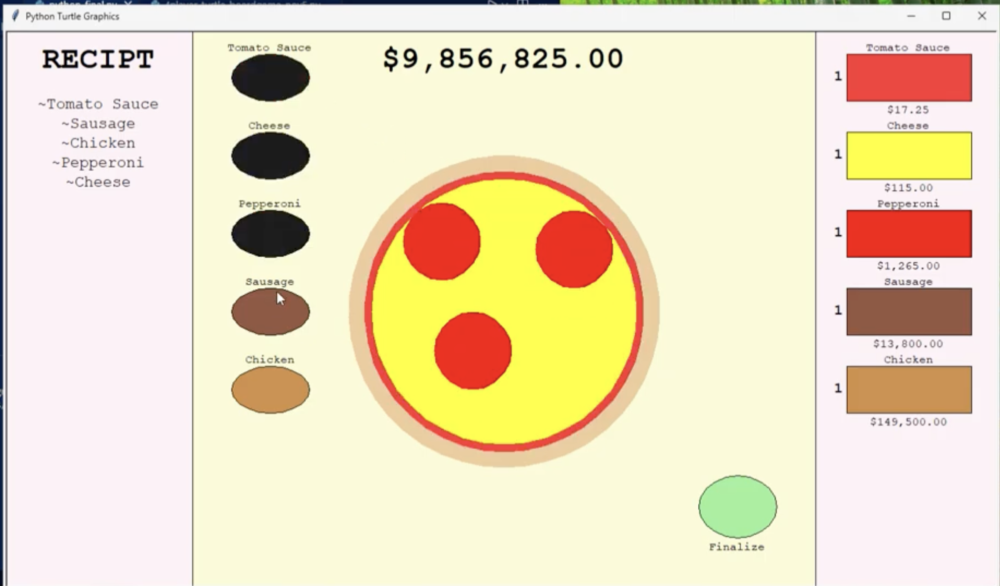

# Restaurant Ordering Game

A visual Python game about making pizza orders, earning money, and upgrading ingredients.

[View my programming portfolio](https://www.charliebarra.com/programming.html)



## The Question

Could I make the game's systems and its visual interface work together instead of keeping everything in the console?

## What I Built

I used Python's Turtle graphics to build a pizza restaurant game. A customer places a random order, the player adds toppings to the pizza, and finalizing the order checks the selected toppings and awards money. The market lets the player buy ingredient upgrades that increase their value.

The random order generator and the visuals are the parts I am most proud of.

## How It Works

- A dictionary stores each topping's income, upgrade price, and ownership level.
- The order generator chooses from unlocked toppings without repeating the same topping.
- Clickable Turtle objects act as ingredient and upgrade buttons.
- Finalizing compares the selected topping buttons with the current order.
- Upgrade prices grow with each purchase, and owned upgrades increase ingredient income.
- The screen redraws the pizza, receipt, money, and market as the game state changes.

## Something That Surprised Me

The upgrade system took the longest. It was not just one button: the cost, ownership level, income, display, and available money all had to stay connected. The code made me see how quickly a small game economy becomes several pieces of state that all need to agree.

## What I Would Change Next

I would improve the visuals and add more stations so the restaurant has more things to manage than one pizza-making screen.

## Run It

This project uses Python 3 and its standard `turtle` module. It needs a desktop environment that can open a graphics window.

```bash
python3 src/python_final.py
```

Click **Start Game**, use the ingredient buttons to build the displayed order, and use the market buttons to purchase upgrades.

## Files

- `src/python_final.py` — original source code, preserved unchanged
- `images/restaurant-screenshot.png` — original gameplay screenshot
- `SOURCE-INTEGRITY.md` — checksum for verifying the source file

## Source Integrity

The original source is intentionally unchanged. This README explains the code that exists; it does not add assignment details or features that were not in the supplied project.
